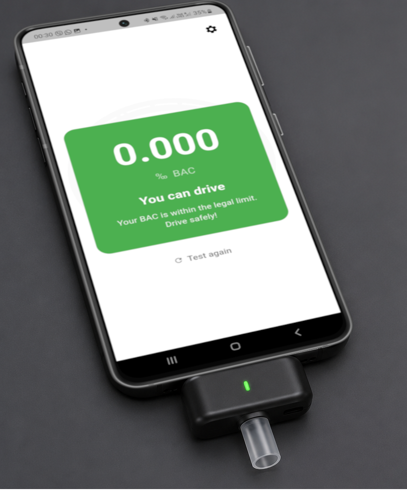
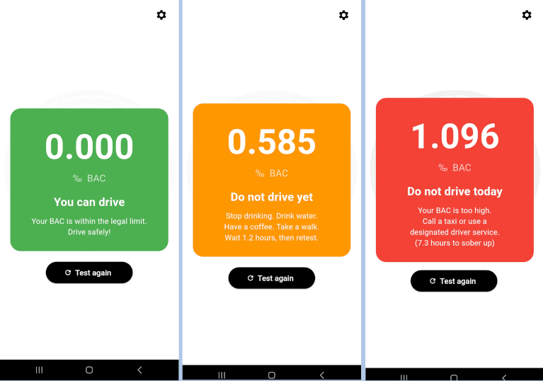
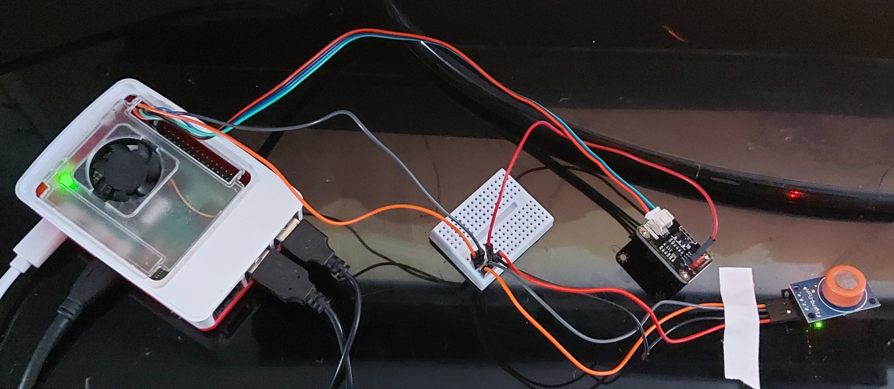

# IoT Breathalyzer with Mobile Application

The IoT project that estimates Blood Alcohol Concentration (BAC) 
using a Raspberry Pi 5 and MQ-3 alcohol sensor, with results displayed 
in a Flutter mobile app.


## How it works

1. The MQ-3 sensor detects alcohol in exhaled breath
2. The ADS1115 ADC converts the analog signal to digital
3. A Python Flask server on the Raspberry Pi serves the data via Wi-Fi
4. The Flutter app reads the data, calculates BAC and shows the result
   
   MQ-3 → ADS1115 → Raspberry Pi 5 → Wi-Fi → Flutter App
## Hardware required

- Raspberry Pi 5
- MQ-3 alcohol sensor module
- DFRobot Gravity ADS1115 16-bit ADC
- Mini breadboard + jumper wires
- Android or iOS smartphone

## Setup — Raspberry Pi

**1. Install dependencies:**
```bash
pip install flask adafruit-circuitpython-ads1x15 --break-system-packages
```

**2. Enable I2C:**
```bash
sudo raspi-config
# Interface Options → I2C → Enable
```

**3. Run the server:**
```bash
cd alcotest
python3 server.py
```

**4. Optional — auto-start on boot:**
```bash
sudo nano /etc/systemd/system/alcotest.service
sudo systemctl enable alcotest
sudo systemctl start alcotest
```

## Setup — Flutter App

**1. Install dependencies:**
```bash
cd alcotest_app
flutter pub get
```

**2. Update the Raspberry Pi IP address in `lib/constants.dart`:**
```dart
const String rpiUrl = 'http://YOUR_RPI_IP:5000/bac';
```

**3. Build and install:**
```bash
flutter build apk --debug
```

## How to use

1. Make sure both devices are on the same Wi-Fi network
2. Power on the Raspberry Pi and wait 30-40 seconds
3. Open the app — calibration starts automatically (30 seconds)
4. When prompted, blow into the sensor for 3 seconds
5. View your result:
   - 🟢 Green — you can drive
   - 🟠 Orange — do not drive yet
   - 🔴 Red — do not drive today

## Important notes

- The MQ-3 requires 48 hours burn-in before first use
- Do not use mouthwash, hand sanitiser or perfume 15 minutes before testing
- Blow from approximately 2cm distance for 3 seconds
- This is an educational prototype — not a medically certified device

## Project structure
iot-alcotest-rpi-flutter/

├── alcotest/

│   ├── server.py        # Flask REST API server

│   └── alcotest.py      # Initial sensor test script

└── alcotest_app/

└── lib/

├── main.dart              # App entry point

├── calibration_screen.dart # Calibration screen

├── result_screen.dart      # Result screen

├── settings_screen.dart    # Settings screen

└── constants.dart          # Shared constants
## Tech stack

| Component | Technology |
|---|---|
| Hardware controller | Raspberry Pi 5 |
| Alcohol sensor | MQ-3 |
| ADC module | DFRobot Gravity ADS1115 |
| Server language | Python 3 |
| REST API | Flask 3.1 |
| Mobile framework | Flutter 3.41 |
| Mobile language | Dart |
## Network Setup

Both the Raspberry Pi and your smartphone must be on the same network.
You have two options:

### Option A — Mobile Hotspot (recommended for demos)

1. Create a hotspot on your phone:
   - **Name:** any name (e.g. `AlcotestDemo`)
   - **Password:** your choice
   - **Security:** WPA2

2. Connect Raspberry Pi to the hotspot:
```bash
sudo nmcli dev wifi connect "AlcotestDemo" password "yourpassword"
```

3. Assign a static IP to avoid changes between sessions:
```bash
sudo nmcli con mod "AlcotestDemo" ipv4.addresses 192.168.117.100/24 ipv4.gateway 192.168.117.1 ipv4.method manual
sudo nmcli con up "AlcotestDemo"
```

4. Update `lib/constants.dart` with the static IP:
```dart
const String rpiUrl = 'http://192.168.117.100:5000/bac';
```

> ⚠️ Never forget the network on Raspberry Pi — 
> this will reset the static IP assignment.

---

### Option B — Home/Office Wi-Fi

1. Connect Raspberry Pi to your Wi-Fi:
```bash
sudo nmcli dev wifi connect "YOUR_WIFI_NAME" password "YOUR_PASSWORD"
```

2. Check the assigned IP:
```bash
hostname -I
```

3. Update `lib/constants.dart` with the IP shown:
```dart
const String rpiUrl = 'http://YOUR_IP:5000/bac';
```

4. Rebuild the app:
```bash
flutter build apk --debug
```

> ℹ️ With home Wi-Fi the IP may change between sessions.
> Option A with a static IP is more reliable for demonstrations.
